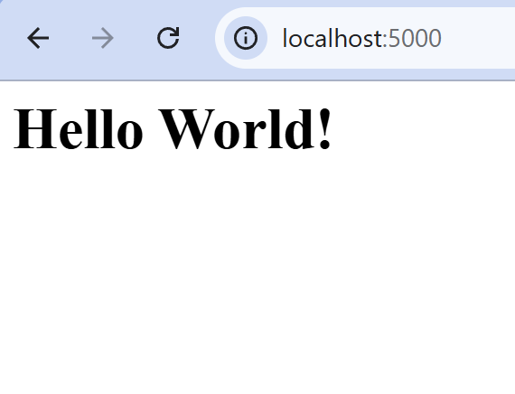

# ECE444 -- PRA2: Flask Web Development + Docker
> Author: Jingqiao Xiao  
> This repo is a clone of https://github.com/miguelgrinberg/flasky  

## Flask Examples
- Example 2-1: Basic Hello route  
    
- Example 2-2: Hello with template  
    
