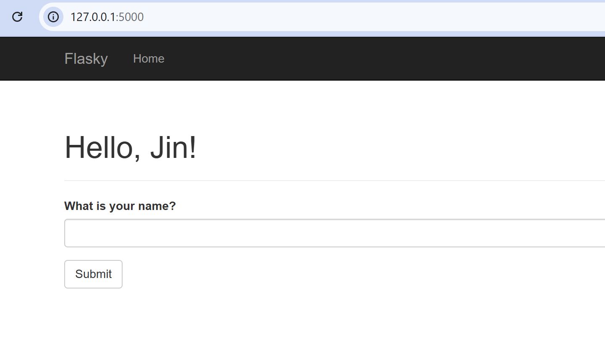
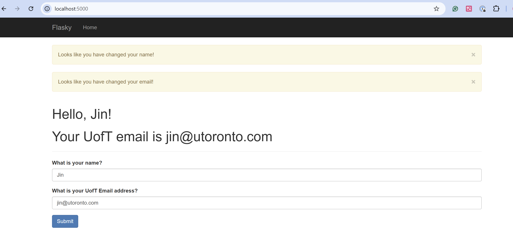

# ECE444 -- PRA2: Flask Web Development + Docker
> Author: Jingqiao Xiao  
> This repo is a clone of https://github.com/miguelgrinberg/flasky  

## Flask Examples
- Example 2-1: Basic Hello World!    
    
- Example 2-2: Hello with user name(Dynamic route)    
      
- Example 3-3: Page with two Flask-Moment timestamps  
      
- Example 4-3: Web form after failed validator    
      
- Example 4-2: Web form after submission   
     
- Example 4-4: Flashed message (changed name)    
    
- Add one more field for filling in email address.      
      
- Successful submit with UofT email     
     
- Incorrect email address.      
    
- Incorrect UofT  email address.      
    

## Docker 
- The log information.  
      